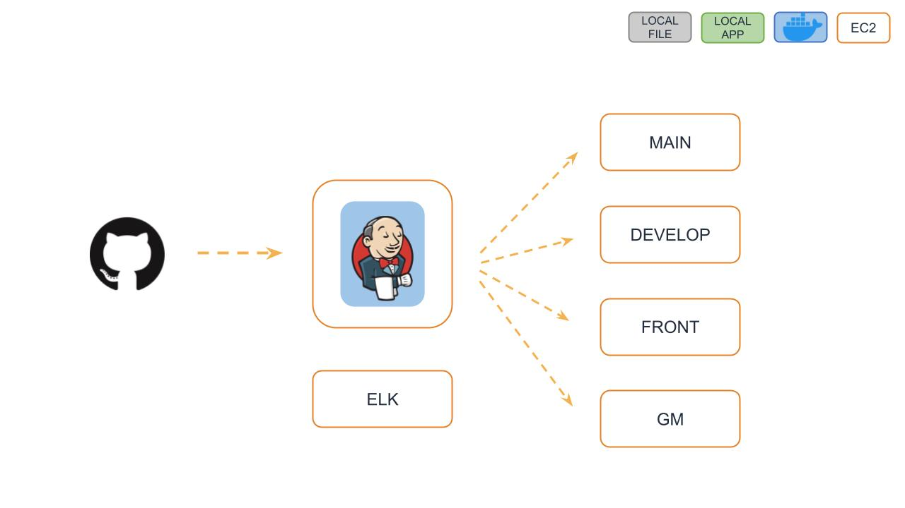
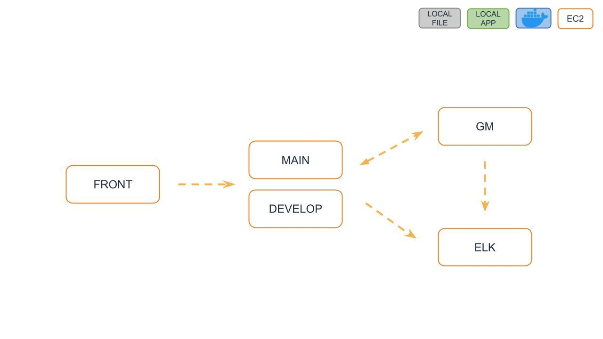
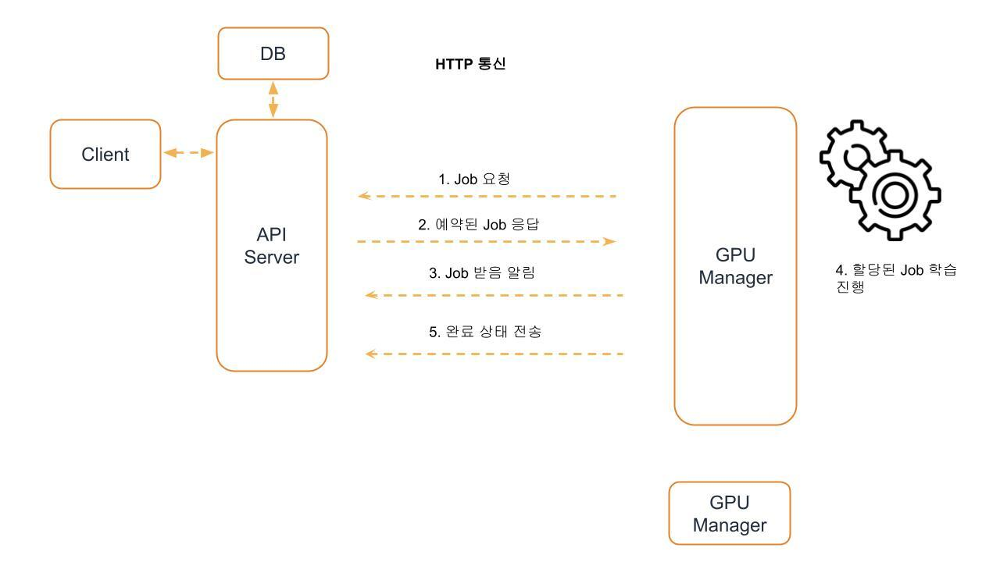
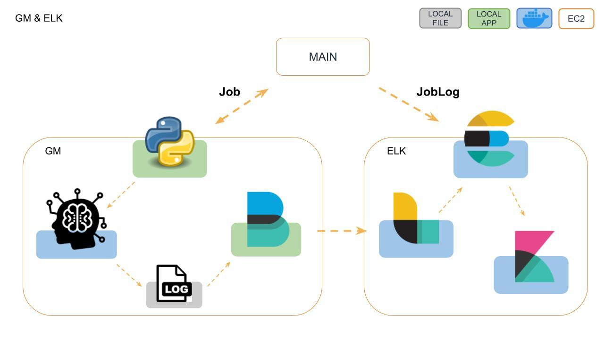

# [GPU 내껀데](https://www.gpuismine.com/)

### 딥러닝 학습 자동화 서비스

---

## 서비스 소개

### 기존현황

- 딥러닝 학습의 경우, 기존 학습의 종료를 사람이 확인하고 다음 학습을 실행
- `기존 작업의 종료~다음 작업의 시작` 시간동안 gpu 자원이 유휴상태
- gpu 가 작업 진행 중인지 사람이 확인

### 서비스

- 메타 정보를 통해 예약만 해두면 기존 작업이 끝나는 대로 자동으로 다음 학습을 진행
- gpu 자원의 유휴상태를 최소화
- 작업 진행여부를 이메일로 알람

---

## 사용방법

<!-- [gif 넣을 예정] -->

1. 회원가입을 통해 로그인을 한다.
2. 기존 등록되어 있는 GpuServer 에 학습을 진행하고 싶은 job 을 등록할 수 있다.
3. job 등록에서 job 메타데이터 정보와 서버를 선택하여 예약할 수 있다.
4. 학습의 진행사항은 job 조회 페이지에서 확인 가능하다.
    - 상태: `대기중`, `진행중`, `완료`, `취소`
    - `진행중`, `완료`인 작업에 대해 상세조회가 가능하다.
        - 실시간으로 학습 진행 로그 확인
        - accuracy & loss / epoch 그래프
    - `대기중`인 작업에 대해서만 예약을 `취소`할 수 있다.
5. **자동**으로 다음 예약된 작업이 실행된다.
6. 학습 시작, 종료 에 등록된 이메일로 알림을 보내준다.

---

## 업데이트 로그

- [v1.0.0](https://github.com/woowacourse-teams/2021-gpu-is-mine/releases)

---

## 기술

### 스택

- front-end

- back-end

- infra

### 서비스 플로우

- Github Actions 를 통한 CI 환경을 구축하였다.
- jenkins 를 통한 자동배포를 구축하였다.
  
- 프론트 서버, 백 서버, GpuManager, ELK 사이에서 데이터가 흐른다.
  
- 백 서버와 GpuManager 사이에서 job 에 대한 상태는 http 통신을 통해 이루어진다.
  
- ELK 를 도입하여 job 에 대한 로그관리를 한다.
  

### TechLogs

- [✨gpu내껀데 QuickStart]()

#### FE

- [FE 성능 최적화: 로딩, 렌더링](https://rattle-king-c48.notion.site/GPU-IS-MINE-089cf77a60764695972a6644f1fb1194)
- [Yarn Berry 도입기](https://velog.io/@bigsaigon333/Yarn-berry-%EB%8F%84%EC%9E%85%EA%B8%B0)

#### BE

- [배럴, 완태의 Elastic Stack 적용기](https://nauni.tistory.com/283)
- [PageableHandlerMethodArgumentResolver Customize 하기 by 완태](https://github.com/woowacourse-teams/2021-gpu-is-mine/wiki/PageableHandlerMethodArgumentResolver-Cusomize-%ED%95%98%EA%B8%B0-by-%EC%99%84%ED%83%9C)
- [젠킨스 jdk 11로 버전 업그레이드 해왔어요!!!](https://ecsimsw.tistory.com/entry/젠킨스-jdk-버전-11로-올리는-방법)
- [코드의 악취를 확인해보자 - Sonarqube](https://github.com/woowacourse-teams/2021-gpu-is-mine/wiki/Sonarqube-사용법)
- [우리 프로젝트는 RESTful 할까요? - Self descriptive와 HATEOS / 대부분 못 지키고 있는 REST 제약조건](https://ecsimsw.tistory.com/entry/REST-API-Self-descriptive와-HATEOS-대부분-못-지키고-있는-제약조건)
- [우리 팀이 flyway를 적용했으면 하는 이유](https://ecsimsw.tistory.com/entry/Flyway로-DB-Migration)
- [서브 모듈 프로젝트에 적용하기 by 완태](https://github.com/woowacourse-teams/2021-gpu-is-mine/wiki/서브-모듈-프로젝트에-적용하기-by-완태)
- [배럴의 자바 코드 정적분석 checkstyle 도입하기](https://nauni.tistory.com/275)
- [배럴, 마갸의 JobQueue 기술 선택하기 - redis, rabbitMQ, kafka](https://nauni.tistory.com/274)
- [LazyInitializationException 처리하기](https://github.com/woowacourse-teams/2021-gpu-is-mine/wiki/LazyInitializationException-%EC%B2%98%EB%A6%AC%ED%95%98%EA%B8%B0)
- [우리 팀 로깅 전략](https://github.com/woowacourse-teams/2021-gpu-is-mine/wiki/우리-팀의-로깅-전략)
- [코기, 완태의 젠킨스 적용기](https://ecsimsw.tistory.com/entry/젠킨스와-Github-hook-빌드-자동화)
- [슬랙으로 깃헙 이벤트 받기](https://ecsimsw.tistory.com/entry/Slack으로-Github-알림-받기-Github-앱-설정하기)

---

## 팀원

||||||||
|:---:|:---:|:---:|:---:|:---:|:---:|:---:|
|[콜린](https://github.com/2SOOY)|[동동](https://github.com/bigsaigon333)|[배럴](https://github.com/knae11)|[코기](https://github.com/ecsimsw)|[완태](https://github.com/wannte)|[마갸](https://github.com/MyaGya)|[에드](https://github.com/sjpark-dev)|
| front-end |front-end|back-end|back-end|back-end|back-end|back-end|

